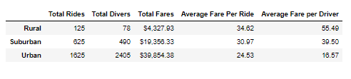

# PyBer Analysis

## Purpose
Pyber is a ride sharing company that has collected considerable data regarding their service over time.  The purpose of this project is to provide exploratory analysis on the captured data in order to determine trends and correlations.  

## Data Sources
Data was provided in the following 2 files:
* city_data.csv -- provides data specific to cities of operation, including city, driver count and city type (urban, suburban or rural).
* ride_data.csv -- provides data specific to each individual ride transaction over time, including city, date, fare and a unique ride identification number.  

These files are located in the attached Resources folder. The data was merged into a single dataframe for analysis.  

## Methodology
The data was analyzed using Python code within Jupyter Notebook.  The code incorporated both Pandas and matplotlib.pyplot.  

## Deliverables 
Deliverable 1: A ride-sharing summary DataFrame by city type
Deliverable 2: A multiple-line chart of total fares for each city type
Deliverable 3: A written report for the PyBer analysis (README.md)

## Discussion
* 

----------------------------------------------------------------------------------
### Appendix of Figures and Tables
----------------------------------------------------------------------------------

 
 
**Fig. 1:  Ride Sharing: A Composite Look**
 
 
 

 
 
**Fig. 2:  Fares Through Time**
 
 
 

 
**Table. 1: Ride Sharing Summary by City **
